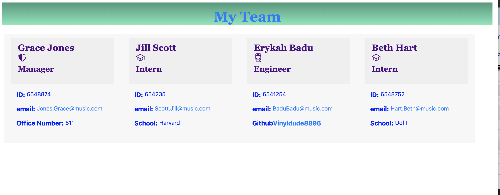

# Team Page Generator

### This app will use command line input to generate an HTML page formatted with CSS and bootstrap. This page will display the members of a team, including Manager, Interns and Engineers
### Examples of data input are: Name, employee IDs, emails, office number, school(for Intern), github username(for engineers).

### badges

## Table of Contents

- [installation](#installation)
- [contribution guidelines](#contribution)
- [Test Instructions](#testing)
- [License](#license)
- [Questions](#questions)

### Installation
To use this app, you would have to clone the github repo and run it from the command line.

### Contribution Guidelines
N/A as of yet
### Testing
Multiple days were spent testing to ensure proper data was being written to the ReadMe.md file.
### Questions
    email address : kevinnivek@me.com
    - additional instructions 
    I can be contacted by phone as well, but prefer email contact first.

### Image of example readme.md

### 
link to video on how this app works 

https://drive.google.com/file/d/1sq776JCHLjHUWNABCKT1H7-7PODKvOpn/view